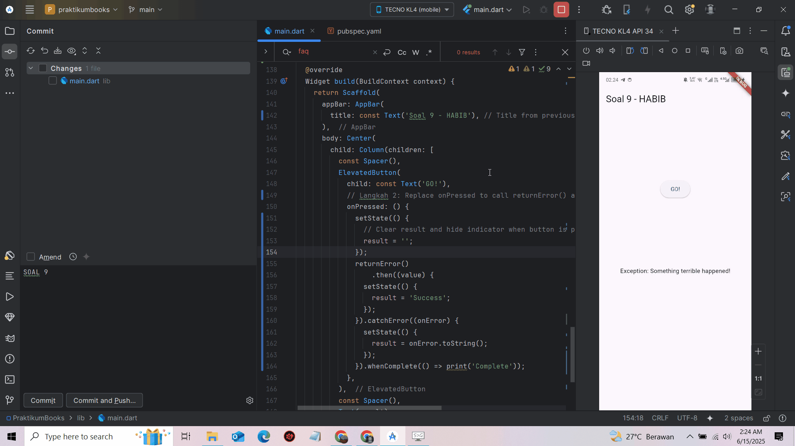

📚 Flutter Asynchronous Programming Repositori ini berisi tugas-tugas praktikum Pemrograman Asynchronous pada Flutter, berdasarkan materi perkuliahan Aplikasi Mobile Lanjutan.

🚀 Getting Started Proyek ini merupakan titik awal untuk memahami konsep asynchronous programming dalam Flutter. Setiap soal berisi penjelasan, cuplikan kode, serta hasil output berupa screenshot atau GIF.

📝 Daftar Soal

✅ Soal 1 Tambahkan nama panggilan Anda pada judul aplikasi sebagai identitas hasil pekerjaan Anda.

📸 Hasil: Animation

✅ Soal 2 Ambil dan tampilkan data buku dari endpoint berikut:

📎 URL: https://www.googleapis.com/books/v1/volumes/LKLbDwAAQBAJ

📸 Hasil: Screenshot 2025-06-09 144322

✅ Soal 3 Kode memotong 450 karakter pertama dari hasil respons API menggunakan substring(0, 450) untuk membatasi tampilan teks. Jika terjadi error (misalnya data terlalu pendek atau gagal ambil data), blok catchError akan menangkap error tersebut dan menampilkan pesan "An error occurred".

Capture hasil praktikum Anda berupa GIF: 📸 Hasil: S33

✅ Soal 4 Langkah 1: Buat tiga fungsi async:

returnOneAsync

returnTwoAsync

returnThreeAsync Masing-masing memiliki delay 3 detik menggunakan await Future.delayed(...), lalu mengembalikan nilai 1, 2, dan 3.

Langkah 2: Jalankan fungsi tersebut secara berurutan dalam fungsi count(). Gunakan await untuk menunggu hasil dari masing-masing fungsi, kemudian jumlahkan total (hasil akhir: 6) dan tampilkan di UI menggunakan setState().

🕒 Total waktu proses: 9 detik (3 + 3 + 3)

📸 Hasil: s4

✅ Soal 5

Kode Completer (getNumber & calculate): getNumber() membuat sebuah Future menggunakan Completer, dan langsung mengembalikannya.
calculate() menjalankan proses delay selama 5 detik, lalu menyelesaikan janji tersebut dengan nilai 42.

Teknik ini memberi kontrol manual atas penyelesaian sebuah Future.

Kode onPressed: Ketika tombol ditekan, getNumber() dipanggil dan mengembalikan Future.
Gunakan .then() untuk menunggu hasilnya.

Setelah 5 detik, hasil (42) didapat dan ditampilkan menggunakan setState().

📸 Hasil: s5

✅ Soal 6 Pada soal ini, ditambahkan penanganan error (error handling) ke dalam kode:

Kode calculate() Menggunakan blok try-catch.
Jika error terjadi, maka ditangani dan Completer akan menyelesaikan Future-nya dengan status error menggunakan completer.completeError().

Kode onPressed() Memiliki .catchError() untuk menangani error dari Future.
Dengan ini, pengguna dapat menerima pesan error seperti "An error occurred", dan aplikasi tetap stabil.

📸 Hasil: s6

SOAL 7

📸 Hasil:

s7

SOAL 8

Perbandingan FutureGroup dan Future.wait:

🔹 Langkah 1: Menggunakan FutureGroup Pada pendekatan ini, digunakan FutureGroup yang berasal dari package eksternal bernama async. Konsepnya adalah kita dapat menambahkan beberapa proses asynchronous (Future) satu per satu secara dinamis, seiring berjalannya program. Pendekatan ini berguna saat daftar proses asynchronous belum diketahui semuanya di awal. Setelah seluruh proses ditambahkan, kita perlu memanggil close() untuk memberi tahu bahwa tidak akan ada Future lain yang ditambahkan lagi. Setelah itu, hasil dari semua proses dapat diproses secara serentak.

Keunggulan FutureGroup:

Dapat menambahkan proses asynchronous secara bertahap (dinamis).

Lebih fleksibel untuk kebutuhan kompleks, misalnya ketika Future muncul dari perulangan, kondisi tertentu, atau alur logic yang dinamis.

Memberikan kontrol lebih terhadap kapan semua proses dianggap selesai.

Cocok digunakan ketika jumlah atau jenis proses tidak diketahui sejak awal.

Namun, karena bukan bagian dari pustaka inti Dart, penggunaan FutureGroup memerlukan tambahan package eksternal (async) dan import khusus dalam proyek.

🔹 Langkah 4: Menggunakan Future.wait Pendekatan ini menggunakan Future.wait, yang merupakan fitur bawaan dari Dart. Di sini, seluruh daftar proses asynchronous harus sudah diketahui sejak awal, kemudian dijalankan secara paralel bersamaan. Hasilnya akan dikembalikan dalam bentuk list setelah semua proses selesai.

Keunggulan Future.wait:

Penulisan lebih sederhana dan lebih langsung (langsung sekaligus).

Cocok digunakan saat semua proses asynchronous sudah tersedia di awal.

Tidak perlu package tambahan karena merupakan bagian dari library inti Dart.

Lebih ringkas dan mudah dipahami, terutama untuk skenario umum.

Namun, kekurangannya adalah tidak bisa menambahkan proses tambahan setelah fungsi dipanggil. Jadi kurang cocok untuk kasus yang memerlukan fleksibilitas.

SOAL 9

📸 Hasil:

s9

SOAL 10

Penjelasan untuk langkah 1: Masih sama seperti Soal 9 yaitu menampilkan error delay dengan waktu 2 detik dan menampilkan ('Something terrible happened!')

Penjelasan untuk langkah 4: Apa Hasilnya?

Ketika Anda menjalankan kode ini dan menekan tombol "GO!":

Aplikasi akan menampilkan "Something terrible happened!" di layar setelah sekitar 2 detik. Di konsol debug, Anda akan melihat teks "Complete". Indicator loading (CircularProgressIndicator) akan muncul sesaat setelah tombol ditekan dan kemudian menghilang setelah 2 detik.

Dibawah ini bukti hasilnya

📸 Hasil:

s10

SOAL 11

Tambahkan nama panggilan Anda pada properti title "title: const Text('Current Location - Faqih'),"

SOAL 12

🔹 Tambahkan delay di sini agar animasi loading terlihat await Future.delayed(const Duration(seconds: 3));

🔹 Apakah Anda mendapatkan koordinat GPS ketika run di browser? Mengapa demikian?

Anda tidak akan mendapatkan koordinat GPS ketika menjalankan aplikasi Flutter di browser (web) menggunakan plugin geolocator.

Mengapa demikian? Plugin geolocator dirancang untuk berinteraksi dengan API lokasi asli (native) dari perangkat seluler (seperti Android dan iOS) atau desktop. Browser memiliki API lokasi sendiri (disebut Geolocation API, bagian dari JavaScript), tetapi plugin geolocator tidak secara langsung terintegrasi penuh atau mendukung semua fungsi API browser tersebut. Oleh karena itu, kemampuan untuk mengakses lokasi melalui browser dari aplikasi Flutter yang dikompilasi untuk web akan sangat terbatas atau seringkali tidak berfungsi sama sekali melalui plugin geolocator.

Dokumen praktikum Anda juga menyarankan untuk menjalankan project di device atau emulator (bukan browser) untuk hasil yang akurat.

📸 Hasil:

s12
